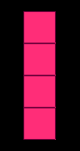
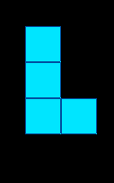
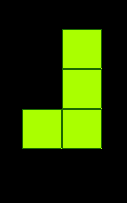
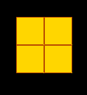
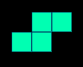
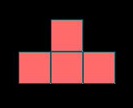
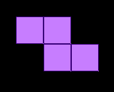

# 🧱 Tetris (C++ & Raylib)

[](https://opensource.org/licenses/MIT)

A colorful, fully functional implementation of the classic arcade puzzle game **Tetris**, built entirely from scratch using C++ and the Raylib graphics library. 

## 🎮 Overview

This project is a recreation of the world-famous block-stacking game. The objective is to manipulate the descending tetrominoes, sliding and rotating them to form solid horizontal lines without any gaps. When a line is formed, it clears and you earn points. If the board fills up and blocks reach the top, the grid resets and you start over!

## ✨ Features

* **Raylib Graphics:** Smooth 120 FPS rendering with a custom 800x1000 window.
* **Custom Color Palette:** Every tetromino features a unique dual-tone color scheme (e.g., Electric Cyan, Hot Pink, Lime Blast) using filled rectangles and distinct borders.
* **Dynamic Line Clearing:** Fully implemented row-clearing logic that drops suspended blocks and tracks your score.
* **Collision Detection:** Boundary walls and block-to-block collision are fully active to prevent overlapping.

## 🧩 The Tetrominoes

The game features the 7 classic shapes made up of 4 square blocks each, programmed with their exact rotational matrices:

| Tetromino | Visual | In-Game Color Theme |
| :---: | :---: | :--- |
| **I-Block** |  | Hot Pink & Dark Magenta |
| **L-Block** |  | Electric Cyan & Deep Blue |
| **J-Block** |  | Lime Blast & Forest Green |
| **O-Block** |  | Golden Yellow & Burnt Orange |
| **S-Block** |  | Mint Green & Dark Navy |
| **T-Block** |  | Coral Red & Dark Teal |
| **Z-Block** |  | Soft Violet & Deep Indigo |

## 🕹️ Controls

*Note: This game uses a split keyboard control scheme.*

* **`A`** : Move block left
* **`D`** : Move block right
* **`S`** : Soft Drop (accelerate the falling piece)
* **`Right Arrow (→)`** : Rotate block clockwise
* **`Left Arrow (←)`** : Rotate block counter-clockwise

## 🚀 Getting Started

Follow these instructions to compile and run the game on your local machine.

### Prerequisites

You will need a C++ compiler and the Raylib library installed on your system.
* **C++ Compiler:** GCC, Clang, or MSVC.
* **Raylib:** [Download and install Raylib](https://www.raylib.com/) for your specific operating system.

### Compilation & Execution

1.  **Clone the repository:**
    ```bash
    git clone [https://github.com/Mr314Aaka/Tetris.git](https://github.com/Mr314Aaka/Tetris.git)
    cd Tetris
    ```
2.  **Compile the code:** *(Example using g++ on Linux/macOS. Adjust your flags depending on your OS and Raylib installation path)*
    ```bash
    g++ main.cpp -lraylib -lGL -lm -lpthread -ldl -lrt -lX11 -o tetris
    ```
3.  **Run the game:**
    ```bash
    ./tetris
    ```

---
*Created by [Mr314Aaka](https://github.com/Mr314Aaka)*
